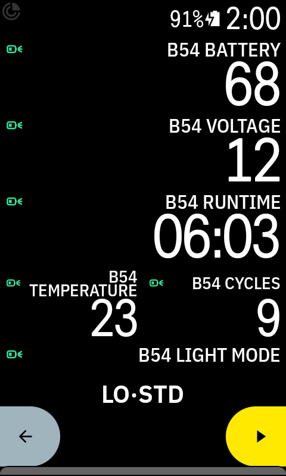
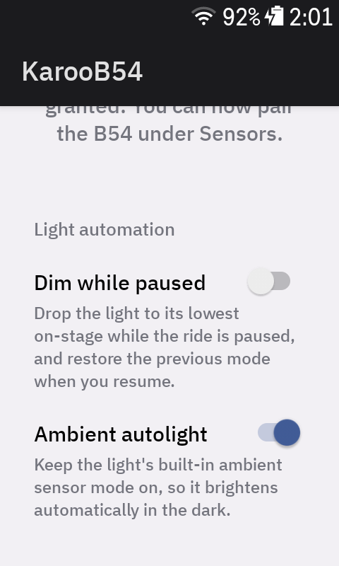

#  KarooB54

A Hammerhead **Karoo** extension that shows your **Supernova B54** bike-light battery as
ride data fields — so on a long ride you can see, at a glance, what matters most: how much
longer the light will last at the current brightness.

> **Disclaimer:** This is an independent hobby project, not affiliated with or endorsed by
> Hammerhead or Supernova. It comes with no warranty; use it at your own risk. I accept no
> liability for any damage that may result from using this software.


---

## 1. What it does

The Karoo has no built-in support for this light. KarooB54 connects to it over Bluetooth
Low Energy and exposes its battery and related values to the Karoo's data-field system, so
you can put them on your ride screens.

By default communication is **read-only** — the extension just reads status. It never
changes the light unless you turn on one of the optional automations (see **Light control**
below).

**Data fields:**

| Field | Unit | Description |
|---|---|---|
| B54 Battery | % | Charge level |
| B54 Runtime | min | Remaining runtime in the active beam mode |
| B54 Light Mode | — | Active beam mode as a compact label (`LO·STD`, `HI·PWR`, `DAY`, …) |
| B54 Voltage | V | Battery voltage |
| B54 Temperature | °C | Battery temperature |
| B54 Cycles | count | Charge cycle count |

The top three — **battery %**, **remaining runtime** and **light mode** — are the ones most
worth putting on a ride screen; the rest are there if you want them.

**Light Mode labels:**

| Label | Meaning |
|---|---|
| `OFF` | Light off |
| `DAY` | Daytime running light |
| `LO·ECO` / `LO·STD` | Low beam — eco / standard |
| `HI·ECO` / `HI·STD` / `HI·PWR` | High beam — eco / standard / power |
| `LO·M1`…`LO·M3` | Low beam, adaptive (MAX) brightness steps 1–3 |
| `HI·M1`…`HI·M5` | High beam, adaptive (MAX) brightness steps 1–5 |

(The adaptive `M` steps only appear if your light uses that mode; otherwise you just see the
fixed presets above.)

Here all fields are shown at once for demonstration:



---

## 2. Installation & setup (for users)

On a **Karoo 3** you can install the extension straight from your phone with the
**Hammerhead Companion app** — no computer needed. (See Hammerhead's
[Companion App sideloading guide](https://support.hammerhead.io/hc/en-us/articles/31576497036827-Companion-App-Sideloading).)

1. **Get the APK** on your phone: open the project's **Releases** page and download the
   latest `KarooB54-*.apk` to your phone.
2. **Send it to the Karoo:** long-press the APK link (or open the downloaded file), choose
   **Share**, and pick the **Hammerhead Companion** app. A prompt appears on the Karoo —
   tap **Install**.
3. **Grant Bluetooth permissions:** open the extension's **"B54 Settings & Permissions"**
   screen (from the Karoo's Extensions library, or tap the notification shown on first
   start) and allow the Bluetooth permission. Without this the sensor scan finds nothing.
4. **If the extension doesn't show up, reboot the Karoo.** A fresh install is usually
   picked up automatically; a reboot is only needed if you replaced/upgraded the extension
   and the Karoo is still holding the old version.
5. **Pair the light:** wake the light (press its button) and make sure it is not connected
   to a phone. On the Karoo go to **Sensors → Add sensor → Extensions** and select it when
   it appears as `B54 …`.
6. **Add data fields:** edit a ride profile and add **B54 Battery** (and any of the other
   fields, e.g. **B54 Light Mode**) from the extension's category.

**Tips**
- The light only advertises for a short window after you wake it — press its button a few
  times while the scan is running.
- It allows a single BLE connection at a time, so keep phone Bluetooth off while pairing.

---

## 3. Light control (optional)

By default the extension never changes the light. Two independent automations can be turned
on in the **"B54 Settings & Permissions"** screen; each stays off until you enable it.

- **Dim while paused:** when the ride pauses (including auto-pause at a stop), the light
  drops to its lowest on-stage to save battery and avoid dazzling anyone; when you resume,
  the previous mode is restored. Off, daytime running light, and the lowest stage are left
  as they are.
- **Ambient autolight:** keeps the light's own built-in ambient-sensor mode switched on, so
  it brightens automatically in the dark. This just toggles the light's native feature.

With both off, the extension is fully read-only.



---

## 4. Feedback & feature requests

I'd genuinely love to hear from you — whether it just works (especially with a different
B54 firmware or a different Karoo), or whether something is off or missing. You don't need
to be a developer for any of this:

- **Report or request something:** open a [GitHub issue](../../issues). A free GitHub
  account is all you need — no coding required. It helps if you mention your light model /
  firmware and Karoo, and whether pairing worked.
- **Ideas, questions & general feedback:** use [GitHub Discussions](../../discussions) if
  enabled — a lightweight forum on the repo, friendlier than the issue tracker for
  "works for me" reports and wishlist chatter.
- **Vote on an existing request:** give it a 👍 reaction so I can see what's most wanted.


---

## 5. Technical / Contributing

### Requirements
- Android SDK 36 and a JDK 17 (Android Studio, or the command-line SDK + Gradle).
- The Karoo Extension SDK (`karoo-ext`) is published on GitHub Packages, which requires
  authentication even for public packages. Put a GitHub token (a PAT with `read:packages`)
  in `~/.gradle/gradle.properties`:
  ```properties
  gpr.user=YOUR_GITHUB_USERNAME
  gpr.key=YOUR_TOKEN
  ```

### Build & test
```bash
./gradlew :app:test            # unit + Robolectric tests (JVM, no device/emulator)
./gradlew :app:assembleDebug   # -> app/build/outputs/apk/debug/app-debug.apk

# Install directly over USB during development (enable Developer options / USB debugging
# on the Karoo). End users should use the Companion app instead (see section 2).
adb install -r app/build/outputs/apk/debug/app-debug.apk
```

### Releases
Releases are automated: push a tag `vX.Y.Z` and the release workflow builds the APK and
publishes a GitHub Release with `KarooB54-vX.Y.Z.apk` attached. The app version
(`versionName`/`versionCode`) is derived from the tag, so nothing needs to be bumped by hand.
```bash
git tag v0.1.0
git push origin v0.1.0
```
The release also publishes a `manifest.json` asset; the Karoo reads it (via `MANIFEST_URL`)
to offer in-app updates when a newer release is available.

### How it works
KarooB54 talks to the light over the Nordic UART Service using short ASCII messages, and
reads the battery level once per second (which also keeps the connection alive), mixing in
beam-mode and info-flag reads. When an automation is enabled it also sends the two control
writes (set beam / set info). The protocol is documented in
[`docs/PROTOCOL.md`](docs/PROTOCOL.md).

### Project structure
```
app/src/main/kotlin/io/github/gitgeshizzle/karoob54/
  B54Extension.kt        KarooExtension service: data fields, scan, connect, automations
  B54Permissions.kt      SDK-dependent BLE permission selection (unit-tested)
  B54Settings.kt         Persisted automation toggles (shared with the service)
  MainActivity.kt        Settings screen: BLE permissions + automation toggles
  LightAutomation.kt     Pause-dim and ambient-autolight automations
  B54Protocol.kt         ASCII protocol decoder + command builders (unit-tested)
  ble/B54BleManager.kt   Native android.bluetooth: scan-then-connect, notify, 1 Hz keepalive,
                         high connection priority, active reconnect on drop, command sending
  ble/B54Light.kt        Device: wires BLE events to the mapper
  ble/B54EventMapper.kt  Decoded messages -> Karoo data points (stateful, unit-tested)
  ble/B54ScanFilter.kt   B54 scan-match rule (unit-tested)
  data/B54DataTypes.kt   The six data-field definitions
  data/LightMode.kt      Beam-mode labels + shared light state (unit-tested)
app/src/test/...         JVM unit tests + Robolectric (permission flow)
```

### License & contributing

Licensed under the **MIT License** — see [LICENSE](LICENSE). Fork it, change it, and use
it for anything (commercial or not). Code contributions are very welcome — open a pull
request (for feedback and feature requests, see section 4). If you fork or build on this, a
link back to the source repository is appreciated.
